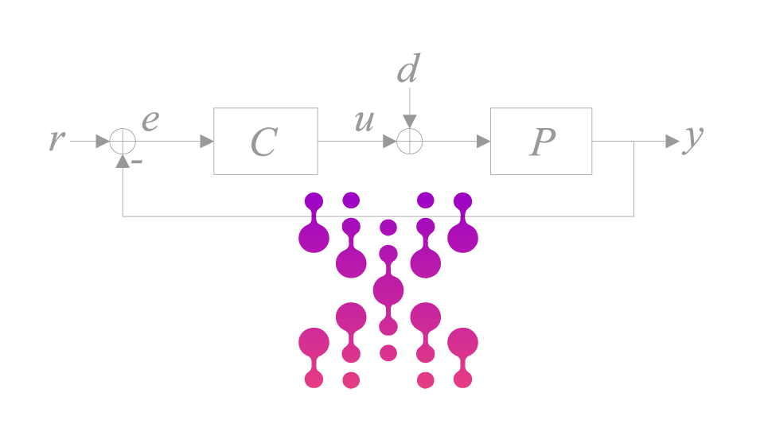

<!-- PROJECT LOGO -->
 

  <a href="https://github.com/othneildrew/Best-README-Template">
    
    <h1 align="center">PID GA Tuning Toolbox</h3>
  </a>

  

  

    PID, PI-D, I-PD and PIDA genetic algorithm parameters optimization made easy with this GUI!
     
    <a href="#documentation"><strong>Explore the docs »</strong></a>
     
     
    <a href="#demo">View Demo</a>
    ·
    <a href=">Report Bug</a>
    ·
    <a href="">Request Feature</a>
  

* * * 

<!-- TABLE OF CONTENTS -->

  
Table of Contents

  <ol>
    <li><a href="#about">About</a></li>
    <li><a href="#features">Features</a></li>
    <li><a href="#usage">Usage</a></li>
    <li><a href="#roadmap">Roadmap</a></li>
    <li><a href="#contributing">Contributing</a></li>
    <li><a href="#license">License</a></li>
    <li><a href="#contact">Contact</a></li>
    <li><a href="#acknowledgments">Acknowledgments</a></li>
  </ol>

## About
The PID GA Tuning Toolbox is a powerful tool for tuning the parameters of PID, PI-D, I-PD, and PIDA controllers using genetic algorithms. It has been extensively used in the development of the article titled [A comparison between PID and PIDA](https://ieeexplore-ieee-org.proxy.unibs.it/document/9921724). 

The tuning of the controllers is determined with genetic algorithms by minimizing the integrated absolute error. Both the set-point following and load disturbance rejection tasks can be selected separately. In order to provide a fair comparison, a constraint on the maximum sensitivity is also posed, by selecting between 1.4 and 2 so that the achieved robustness is taken into account.

The **PID GA Tuning Toolbox** is a valuable resource for achieving optimal controller performance and robustness. It provides a basis for conducting comparative studies, as demonstrated in the referenced article.

(<a href="#readme-top">back to top</a>)

## Features
The PID GA Tuning Toolbox includes the following features:

- **Controller Selection:** Choose from four different controllers.
- **Control Task:** Opt for either setpoint following or load disturbance rejection.
- **Process Compatibility:** Compatible with any type of process.
- **User-Friendly GUI:** Utilize a simple graphical user interface (GUI) to visualize simulation results, including process variable, control action, Bode plot, and Sensitivity plot.
- **Result Evaluation:** Easily assess step response and Bode plot characteristics for effective tuning.

(<a href="#readme-top">back to top</a>)

  
## MATLAB® Toolbox Installation
Follow the steps below to install _FEATool_ as a MATLAB® toolbox, and
to enable running MATLAB® simulation m-scripts

1) Download the
   [GA_PID_tuning.mlappinstall](https://github.com/marco-milanesi/PID-PIDA-GAtuning/blob/main/src/GA_PID_tuning.mlappinstall)
   toolbox installation file.

2) Then start MATLAB®, press the **APPS** toolbar button,
   and select the **Install App** button.

3) When prompted to choose a toolbox file to install, select the
   **GA_PID_tuning.mlappinstall** file and press **OK**.

4) Press the **Install** button if prompted to _"Install to My Apps"_.

Once the toolbox has been installed, an app icon will be available in
the _APPS_ toolbar to start the _GA_PID_tuning_ GUI. (Note that MATLAB® may
not show or indicate the toolbox installation progress
or completion.)

(<a href="#readme-top">back to top</a>)

## Basic Use

To effectively utilize the PID GA Tuning Toolbox, follow these simple steps:

1. **Controller Selection:** Choose the type of controllers you want to tune.

2. **Process Model:** Insert the process model by separating each coefficient with a comma and press the `Insert Transfer Function`. You can verify your transfer function to ensure correct insertion.

3. **Maximum Sensitivity:** Select the maximum sensitivity between *1.4* and *2* for enhanced robustness.

4. **Task Optimization:** Choose your task optimization between *Setpoint Following* and *Load Disturbance Rejection* based on your control requirements.

5. **Algorithm Parameters:** Configure the *Population Size* and the *Maximum Generation* as needed for your tuning process.

6. **Start Simulation:** Finally, press `Start Simulation` to begin the tuning process.

These straightforward steps will help you make the most of the PID GA Tuning Toolbox for your controller parameter optimization needs.

* * * 
### Demo

https://github.com/marco-milanesi/PID-PIDA-GAtuning/assets/47824890/489f6ea7-64fc-49e9-8be6-e7ddbec05fe6

(<a href="#readme-top">back to top</a>)

<!-- LICENSE -->
## License

Distributed under the MIT License. See <a href=https://github.com/marco-milanesi/PID-PIDA-GAtuning/blob/main/LICENSE>`LICENSE.txt`</a>  for more information.

(<a href="#readme-top">back to top</a>)

## Contact

- Marco Milanesi - <a href = "mailto: marco.milanesi.99@gmail.com">marco.milanesi.99@gmail.com</a>
- Edoardo Mirandola - <a href = "mailto: e.mirandola@studenti.unibs.it">e.mirandola@studenti.unibs.it</a>

(<a href="#readme-top">back to top</a>)

## Documentation

| IAE function | Cost Addition Function |
|:-----:|:-----:|
|  |  
|

## Type of Controllers

### PID Controller
-------------------------------------------------

### PI-D Controller
-------------------------------------------------
Proportional and Integral action is applied to the control error while Derivative action is applied to the process variable.

### I-PD Controller
-------------------------------------------------
Integral action is applied to the control error while Proportional and Derivative action is applied to the process variable.

### PIDA Controller
-------------------------------------------------

